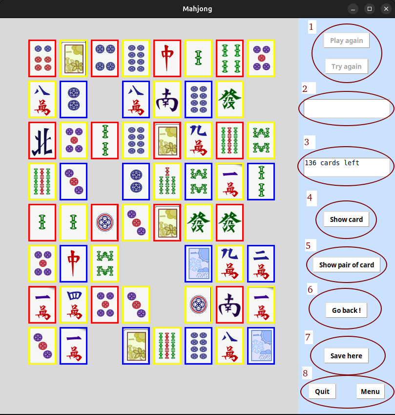
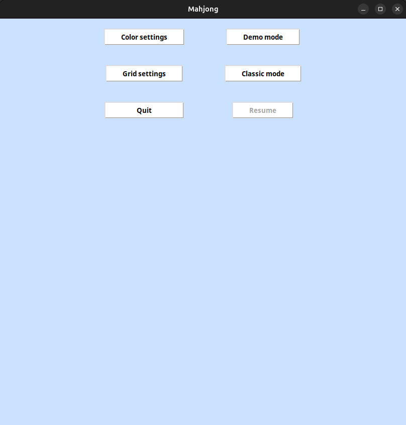
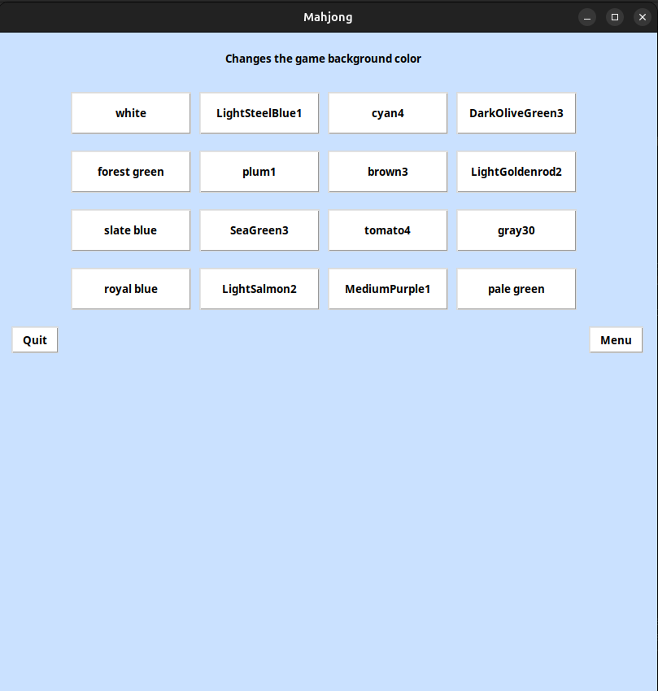
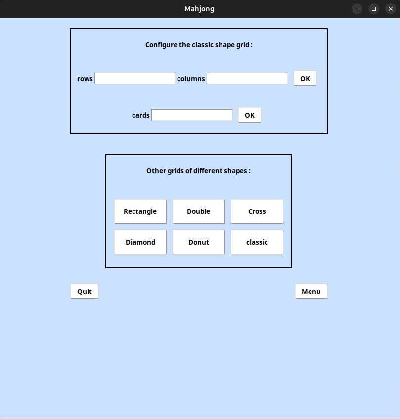

# Mahjong en Python avec Tkinter

## Description

Jeu du Mahjong implémenté en Python à l'aide de la bibliothèque Tkinter pour une interface utilisateur intuitive.

## Fonctionnalités principales

+ Règles du jeu: le but est d'éliminer toutes les cartes de la grille en les associant par paires identiques.

+ Modes de jeu : mode classique.

+ Personnalisation via l'interface : modification de l'arrière plan du jeu, modification de la forme de la grille, 
modification de la taille de la grille et modification du nombre de cartes dans la grille.

+ Il est important de savoir que lorsque que vous allez jouer sur une grille d'une forme différence que la grille classique vous ne pourrez pas modifier la taille/nombre de cartes de celle-ci.

+ Sauvegarde et reprise : possibilité de sauvegarder les parties en cours et de les reprendre ultérieurement.

## Comment lancer le jeu

+ Vous devez compiler le fichier mahjong/src/main.py

+ Vous pouvez le compiler avec un IDE (VSCodium, PyCharm, etc..).

+ Vous pouvez également le compiler dans un terminal (mettez vous dans mahjong/src/) avec la commande : python3 main.py

## Contribuer

+ N'hésitez pas à signaler des bugs.

+ N'hésitez pas à proposer de nouvelles fonctionnalités.

+ N'hésitez pas à améliorer le code existant.

## Licence

Ce projet est sous licence [MIT].

## Captures d'écran

+ (1): Boutons pour recommencer une partie.

+ (2) : informations lorsque que la partie est terminée.

+ (3): informations sur le nombre de cartes restantes dans la grille (en temps réelle).

+ (4): montrer une carte jouable, c'est-à-dire une carte qui a au moins une carte identique à elle sur la grille.

+ (5): montrer un couple de cartes jouables, c'est-à-dire un couple de cartes qui sont identiques.

+ (6): efface le mouvement précèdement fait (retour en arrière).

+ (7): sauvegarder la grille.

+ (8): bouton pour quitter le jeu et bouton pour aller dans le menu principal.

## Post-scriptum

Ce projet constitue une refonte d'un ancien jeu de Mahjong développé en L1 informatique (celui-ci est disponible dans deprecated.zip).
L'objectif initial est de migrer vers une architecture MVC et d'appliquer les principes de la POO. 
Une refonte graphique avec intégration du mode démo ainsi qu'une optimisation des algorithmes sont prévues à plus long terme.

Les commentaires du code sont en français, profitez en pour le lire !
