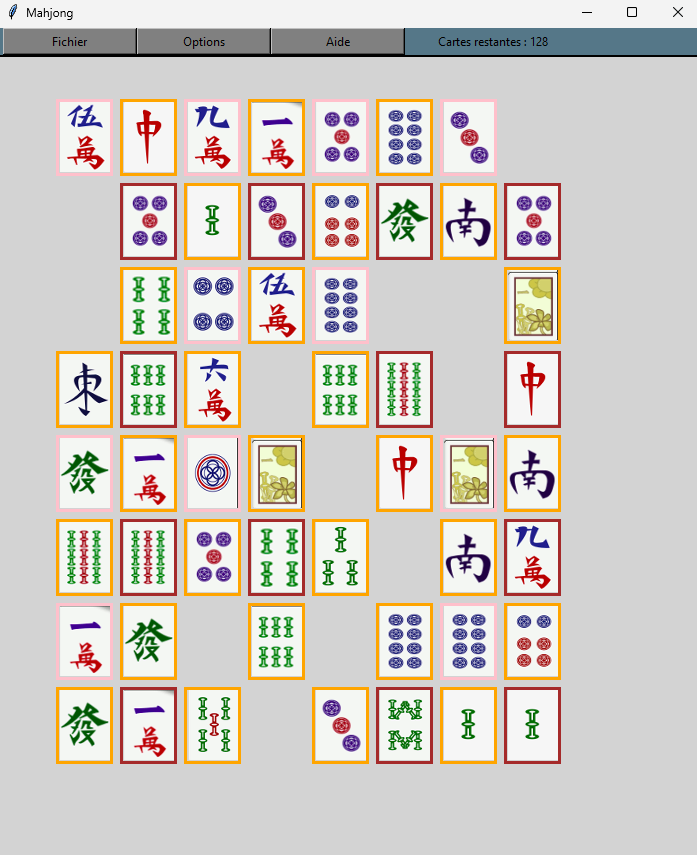

# Jeu du Mahjong

## Description

Jeu du Mahjong implémenté en Python à l'aide de la bibliothèque Tkinter. Pour ce projet j'ai utilisé l'architecture MVC ainsi que le pattern observer.
J'ai également utilisé le pattern strategy pour les différents types de grilles (losange, rectangle, donut, etc...).

## Règles du jeu

Le but est d'éliminer toutes les cartes de la grille en les associant par paires identiques.

## Fonctionnalités principales

+ Plusieurs types de grilles sont disponibles.

+ Possibilité de sauvegarder votre partie en cours et de la reprendre ultérieurement.

## Comment lancer le jeu

Pour lancer le jeu vous aller devoir éxécuter le fichier `src/main.py`.

Si vous êtes sous LINUX installez [python3](https://docs.python.org/fr/3.13/using/unix.html). Ensuite lancez la commande : `python3 main.py` ou créez un [environnement python3](https://docs.python.org/3/library/venv.html).

Si vous êtes sous WINDOWS installez [python3](https://www.python.org/downloads/windows/). Ensuite lancez la commande `python main.py` ou créez un [environnement python3](https://docs.python.org/3/library/venv.html).

Vous pouvez également lancer le jeu via un IDE (Codium, PyCharm, Tonny, etc...), pour cela référez-vous à la documentation de celui-ci.

## Contribuer

+ N'hésitez pas à signaler des bugs.

+ N'hésitez pas à améliorer le code existant.

## Licence

Ce projet est sous licence [MIT].

## Captures d'écran

## Crédits des images

Icones conçu par [www.freepik.com](https://fr.freepik.com/).

