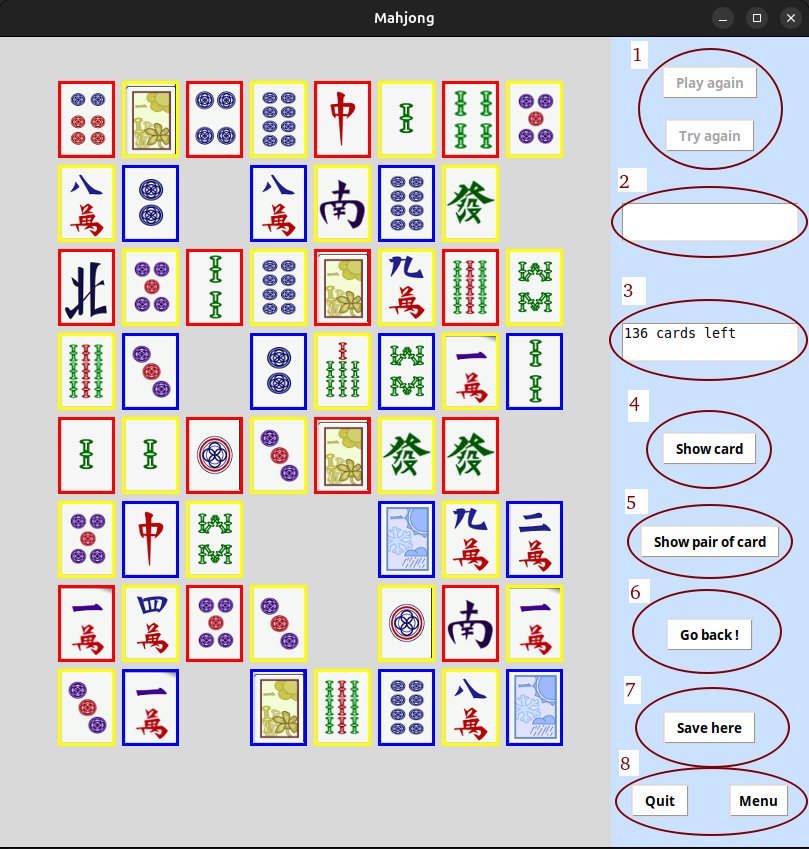

# Mahjong in Python with Tkinter

## Description

Mahjong game implemented in Python using the Tkinter library for an intuitive user interface.

## Main features

+ Rules of the game: the goal is to eliminate all the cards from the grid by matching them into identical pairs.

+ Game modes: classic mode.

+ Customization via the interface: modification of the game background, modification of the shape of the grid, 
changing the size of the grid and changing the number of cards in the grid.

+ It is important to know that when you are going to play on a grid with a shape different from the classic grid you will not be able to modify the size/number of cards on it.

+ Save and resume: ability to save current games and resume them later.

## How to start the game

+ You must compile the mahjong/src/main.py file

+ You can compile it with an IDE (VSCodium, PyCharm, etc.).

+ You can also compile it in a terminal (go to mahjong/src/) and use the command: python3 main.py

## Contribute

+ Don't hesitate to report bugs.

+ Don't hesitate to suggest new features.

+ Don't hesitate to improve existing code.

## License

This project is licensed under [MIT].

## Screenshots

+ (1): Buttons to restart a game.

+ (2): information when the game is over.

+ (3): information on the number of cards remaining in the grid (in real time).

+ (4): show a playable card, that is to say a card which has at least one card identical to it on the grid.

+ (5): show a pair of playable cards, that is to say a pair of cards that are identical.

+ (6): erases the previously made movement (backtrack).

+ (7): save the grid.

+ (8): button to exit the game and button to go to the main menu.

## Post-scriptum

This project constitutes a rework of an old Mahjong game developed in first yeard computer science (this one is available in deprecated.zip).
The initial goal is to migrate to an MVC architecture and using OOP principles. 
A graphical overhaul with integration of demo mode as well as optimization of algorithms are planned in the longer term.

The code comments are in French.

